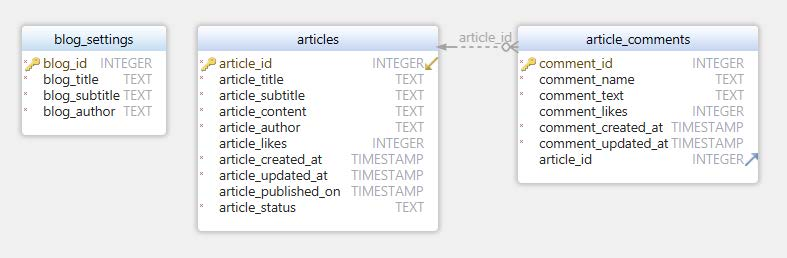

### CM2040 Database Networks and the Web

#### Installation requirements

- NodeJS - version 16 or higher
  - follow the install instructions at https://nodejs.org/en/
  - we recommend using the latest LTS version
- Sqlite3 - version 3.40.1 or higher
  - Windows users: follow instructions here https://www.sqlitetutorial.net/download-install-sqlite/
  - Mac users: it comes preinstalled
  - Linux users: use a package manager eg. apt install

To install all the node packages run `npm install` from the project directory

#### Getting started

- Install packages with `npm install`
- If there is previous database clean it with `npm run clean-db` else skip this step
- Create the database with `npm run build-db`
- Start the server with `npm run start`
- Access the web app via http://localhost:3000

#### Commands

- `npm run start` - start the server
- `npm run build-db` - create the database
- `npm run clean-db` - delete the database
- `clean-db` - delete the database
- `npm run dev` - start the server using nodemon

#### Database schema

#### How to use the web app

- The web app can be accessed via http://localhost:3000
- The web app has 2 main pages
  - Reader page: http://localhost:3000/
  - Author page: http://localhost:3000/author
- Reader and author pages can be switched between using the buttons in the top right corner of the page.
- The reader page allows you to view the published articles in the database.
- The author page allows you to create new articles and edit existing ones.
